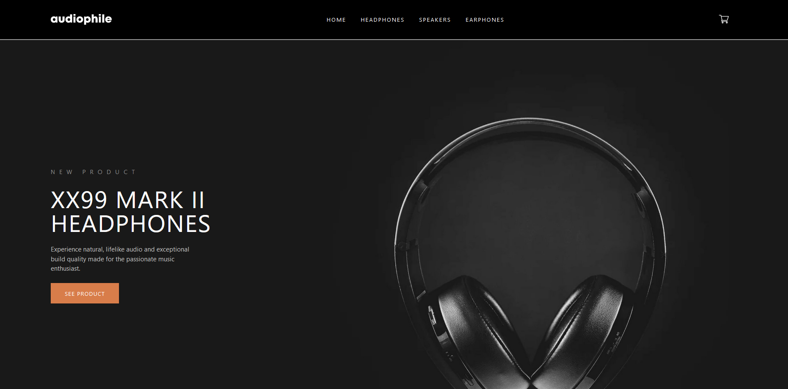

# Audiophile - React Front-End Site

#### [Audiophile Site](https://audio-store.netlify.app/)
### Author:
Hunter Bernier
### Description:
This is an e-commerce site selling headphones, earphones, and speakers. It incorporates four pages: Home, headphones landing page, speakers landing page, and an earphones landing page using React-Router-DOM. It also includes a working cart and custom checkout page. The designs for the site were supplied through Frontend Mentor.
### Languages and Libraries Used:
- React
- JavaScript
- HTML
- Tailwind
- React-Router-DOM
- React-Redux
- Redux-Toolkit